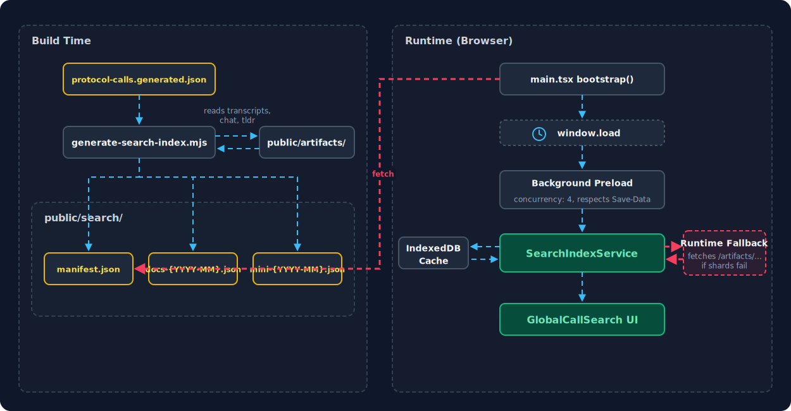

# Global Call Search: Prebuilt Sharded Index

## Summary

Forkcast uses a prebuilt, sharded MiniSearch index for global call search:

- A build-time script (`scripts/generate-search-index.mjs`) parses all call artifacts and produces static JSON shards.
- The browser loads shards lazily, with background preload after page load.
- If prebuilt shards are unavailable, a runtime fallback builds the index from raw artifact files.

The result is near-instant search on first open, without bloating the initial page load.

## Context

Previous search behavior:

- The index was built entirely in the browser from artifact files on first use.
- First open was laggy because indexing required many network requests + parsing + index construction.

Size observations (as of March 1, 2026):

- Main app shell: ~210 KiB Brotli.
- Full prebuilt index (all shards combined): ~3.6 MiB Brotli.
- Search corpus grows over time as new calls are added.

## Architecture



### Build-time index generation

The `generate-search-index` npm script runs during `npm run build`, after `compile-eips` and before `lint`. It:

1. Reads `src/data/protocol-calls.generated.json` for the call manifest.
2. For each call, reads artifacts from `public/artifacts/{type}/{date}_{number}/`:
   - `transcript_corrected.vtt` (preferred) or `transcript.vtt`
   - `chat.txt`
   - `tldr.json` (highlights, action items, decisions, targets)
3. Parses each artifact into `IndexedContent` entries.
4. Groups entries into monthly shards by call date (`YYYY-MM`).
5. For each shard, builds a MiniSearch index and writes two files to `public/search/`:
   - `docs-{YYYY-MM}.json` — raw document entries
   - `mini-{YYYY-MM}.json` — serialized MiniSearch index
6. Writes `public/search/manifest.json` with shard metadata and SHA-256 checksums.

The `public/search/` directory is gitignored — it is generated fresh on every build.

### Manifest format

```json
{
  "schemaVersion": 1,
  "indexVersion": "prebuilt-minisearch-v1",
  "shardStrategy": "monthly",
  "builtAt": "2026-03-01T12:00:00.000Z",
  "appVersion": "1.0.0",
  "shardCount": 24,
  "totalDocuments": 45000,
  "totalCalls": 180,
  "shards": [
    {
      "id": "2024-01",
      "docsFile": "docs-2024-01.json",
      "miniFile": "mini-2024-01.json",
      "hash": "abc123...",
      "docCount": 1800,
      "callCount": 8,
      "fromDate": "2024-01-04",
      "toDate": "2024-01-25"
    }
  ]
}
```

### Sharding strategy

Shards are keyed by the call's year-month (`YYYY-MM`). This gives:

- Stable, deterministic shard boundaries — adding a new call only touches the shard for that month.
- Predictable shard sizes — each month has a similar number of calls.
- A natural recency ordering for prioritized loading.

### Runtime loading model

The `SearchIndexService` singleton manages the full lifecycle:

**1. Bootstrap (app startup — `src/main.tsx`)**

- Fires `ensureManifest()` to fetch `/search/manifest.json` (non-blocking, `cache: 'no-store'`).
- After `window.load`, checks network conditions (`navigator.connection`) and starts background shard preload if appropriate.
- Skips eager preload on `Save-Data` or `slow-2g`/`2g` connections.

**2. Search modal opened (`getIndex()`)**

- Loads the 2 most recent shards first (priority shards) so search is usable quickly.
- Kicks off background preload for remaining shards.
- Shows a progress bar: "Loading search shards... 3/24".

**3. Search query executed (`search()`)**

- Ensures all shards are loaded (waits for any in-flight background preload, then loads any remaining shards with concurrency of 4).
- Searches all loaded MiniSearch shard instances.
- Applies scoring bonuses (exact phrase match +10, all tokens present +5, action items +3, agenda +2).
- Filters by call type and content type.
- Returns top 100 results sorted by score, then by date (newest first).

**4. Fallback to runtime indexing**

If the manifest fetch fails, any shard fetch fails after retries, or the prebuilt path cannot guarantee complete coverage:

- The service switches to runtime fallback mode.
- Builds a MiniSearch index from raw artifact files fetched via `/artifacts/...`, with concurrency of 8.
- Caches the built index in IndexedDB (store: `search_index`, version key: `2.0.0-minisearch`, TTL: 24 hours).

### Client caching

Prebuilt shards are cached in IndexedDB (store: `search_shards`):

- Cache key: `{indexVersion}:{shardId}:{hash}`.
- On subsequent loads, cached shards are rehydrated without network requests if the hash matches the manifest.
- Cache is implicitly invalidated when the manifest's `indexVersion` or shard `hash` changes on deploy.

### MiniSearch configuration

Both the build script and runtime service use identical MiniSearch settings — these **must stay synchronized**:

- **Fields**: `['searchableText']` (speaker name + text concatenated)
- **Tokenizer**: lowercase, strip punctuation, split on whitespace, drop single-character tokens
- **processTerm**: lowercase + trim, drop terms with length <= 1

> **Important**: The tokenizer, processTerm, and searchableText construction are duplicated between `scripts/generate-search-index.mjs` and `src/services/searchIndex.ts`. If one changes without the other, prebuilt indexes will silently produce degraded search results. A future improvement is to extract these into a shared module.

### Key files

| File | Role |
|------|------|
| `scripts/generate-search-index.mjs` | Build-time index generator |
| `src/services/searchIndex.ts` | Runtime search service (prebuilt loader + fallback builder) |
| `src/components/GlobalCallSearch.tsx` | Search modal UI |
| `src/main.tsx` | Calls `searchIndexService.bootstrap()` at app startup |
| `public/search/manifest.json` | Generated shard manifest (gitignored) |
| `public/search/docs-*.json` | Generated document shards (gitignored) |
| `public/search/mini-*.json` | Generated MiniSearch index shards (gitignored) |

### Data flow

```
Build time:
  protocol-calls.generated.json
    → generate-search-index.mjs
      → reads public/artifacts/{type}/{date}_{number}/*
      → writes public/search/manifest.json
      → writes public/search/docs-{YYYY-MM}.json
      → writes public/search/mini-{YYYY-MM}.json

Runtime (prebuilt path):
  main.tsx bootstrap()
    → fetch manifest.json
    → after window.load: background preload shards (respects Save-Data / slow connections)

  search modal opened:
    → load 2 most recent shards (priority)
    → background preload remaining shards (concurrency: 4)

  search query:
    → ensure all shards loaded
    → search each MiniSearch shard instance
    → score, filter, sort, return top 100

Runtime (fallback path):
  manifest or shard fetch fails
    → fetch raw artifacts from /artifacts/...  (concurrency: 8)
    → build MiniSearch index in browser
    → cache in IndexedDB (TTL: 24h)
```

## Performance guardrails

- Index assets are not in the initial JS/CSS bundle.
- No blocking preload tags for search shards.
- Background preload starts only after `window.load`.
- Respects `Save-Data` header and slow connection types (`slow-2g`, `2g`).
- Shard loading uses batched concurrency (4) to avoid saturating the network.

## Why not Pagefind

Forkcast depends on segment-level call artifacts (timestamps, speakers, action/agenda distinctions) and existing MiniSearch ranking/filter behavior tied to this schema. Switching engines would add migration complexity without clear product benefit.
